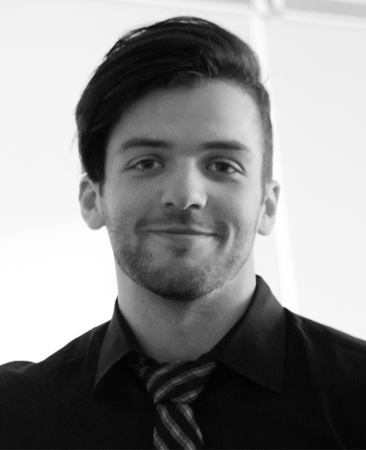
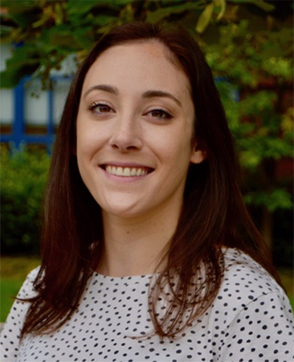
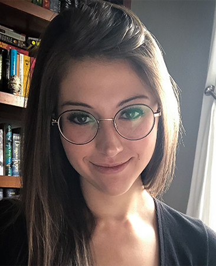
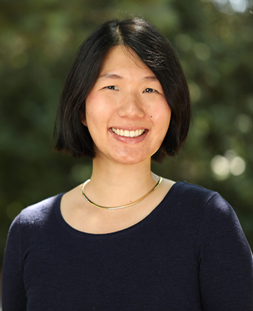

```{r load_libraries, include = FALSE}
library(here)
devtools::install_github("ropenscilabs/icon")
```

***

<!-- `){width="100%"} -->

# Welcome!

This blog was created as our final project for [EDLD 654](https://uo-datasci-specialization.github.io/c4-ml-fall-2020/index.html). This course focused on applied machine learning techniques for educational data scientists, with an emphasis on supervised learning methods. Considering the primary goal of these methods is to create models capable of making accurate predictions, we had to work together as a team to build a predictive model for unseen data. Here, we provide a description of the data used and our analysis procedure, along with an analysis of model performance and a description of why we chose the final model we did.

<br />

# About us

**Cameron S. Kay, M.S., M.A.** 

```{r out.width="20%",echo=FALSE,out.extra='style="float:left;padding-right:40px"'}

```

Cameron is a doctoral candidate studying personality and social psychology at the University of Oregon. He is interested in incorporating new technologies and methodologies into the study of personality. He is the creator and maintainer of the R packages [panoply](https://github.com/camkay/panoply) and [iccImpact](https://github.com/camkay/iccImpact), as well as the [outRun](https://github.com/camkay/outRun) RStudio Editor Theme. 

<a href="https://twitter.com/cameronskay"> <i class="fab fa-twitter fa-1x"></i></a>
<a href="https://github.com/camkay"> <i class="fab fa-github fa-1x"></i></a>
<a href="https://www.researchgate.net/profile/Cameron_Kay6"> <i class="fab fa-researchgate fa-1x"></i></a>
<a href="mailto:ckay@uoregon.edu"> <i class="fas fa-envelope fa-1x"></i></a>

<div style="clear: both;"></div>

$~$

**Lea Frank, M.S.**

```{r out.width="20%",echo=FALSE,out.extra='style="float:left;padding-right:40px"'}

```

Lea is a doctoral student studying cognitive neuroscience at the University of Oregon. Her research examines how memories are used to help guide novel decisions. She is interested in combining machine learning and neuroimaging methods to understand the neural processes underlying memory-guided decisions. 

<a href="https://twitter.com/lurrfursure?lang=en"> <i class="fab fa-twitter fa-1x"></i></a>
<a href="https://github.com/lfrank14"> <i class="fab fa-github fa-1x"></i></a>
<a href="https://www.researchgate.net/profile/Lea_Frank"> <i class="fab fa-researchgate fa-1x"></i></a>
<a href="mailto:lfrank@uoregon.edu"> <i class="fas fa-envelope fa-1x"></i></a>

<div style="clear: both;"></div> 

$~$

**Ashley L. Miller, M.S.**

```{r out.width="20%",echo=FALSE,out.extra='style="float:left;padding-right:40px"'}

```

Ashley is a doctoral candidate studying memory and attention processes. Specifically, Ashley’s research seeks to identify sources of limitations in learning abilities--and cognitive abilities more broadly--by focusing on how individuals control attention in a goal directed manner. Ashley leverages behavioral and physiological techniques (pupillometry and eye-tracking) to address these questions.

<a href="https://github.com/AshLynnMiller"> <i class="fab fa-github fa-1x"></i></a>
<a href="https://www.researchgate.net/profile/Ashley_Miller52"> <i class="fab fa-researchgate fa-1x"></i></a>
<a href="mailto:amiller8@uoregon.edu"> <i class="fas fa-envelope fa-1x"></i></a>

<div style="clear: both;"></div> 

$~$

**Stephanie Gluck, M.A.**

```{r out.width="20%",echo=FALSE,out.extra='style="float:left;padding-right:40px"'}

```

Stephanie is a doctoral student studying developmental psychology at the University of Oregon. Her research addresses how children become socially aware of others’ thoughts, intentions and emotions – a crucial ability for success in the social world – along with the underlying social and cognitive mechanisms that influence such development.

<a href="https://github.com/s-gluck"> <i class="fab fa-github fa-1x"></i></a>
<a href="https://www.researchgate.net/profile/Stephanie_Chenwu_Gluck"> <i class="fab fa-researchgate fa-1x"></i></a>
<a href="mailto:sgluck@uoregon.edu"> <i class="fas fa-envelope fa-1x"></i></a>

<div style="clear: both;"></div> 

$~$

## Land Acknowledgement

We acknowledge that the University of Oregon is situated on Kalapuya Iliʔi---the ancestral territory of the Kalapuya people. As a University, we should honour the traditional stewards of this land and pay respect to the elders, both past and present.

***

<center>
*Last updated: December 8th, 2020.*
</center>